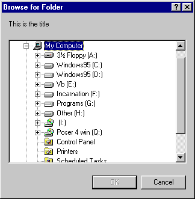

<div align="center">

## Choose Directory


</div>

### Description

Via API calls, has the user choose a directory. No commondialog needed!
 
### More Info
 
Place this in a class to use.


<span>             |<span>
---                |---
**Submitted On**   |
**By**             |[Kamilche](https://github.com/Planet-Source-Code/PSCIndex/blob/master/ByAuthor/kamilche.md)
**Level**          |Beginner
**User Rating**    |4.7 (33 globes from 7 users)
**Compatibility**  |VB 3\.0, VB 4\.0 \(16\-bit\), VB 4\.0 \(32\-bit\), VB 5\.0, VB 6\.0, VB Script, ASP \(Active Server Pages\) 
**Category**       |[Files/ File Controls/ Input/ Output](https://github.com/Planet-Source-Code/PSCIndex/blob/master/ByCategory/files-file-controls-input-output__1-3.md)
**World**          |[Visual Basic](https://github.com/Planet-Source-Code/PSCIndex/blob/master/ByWorld/visual-basic.md)
**Archive File**   |[](https://github.com/Planet-Source-Code/kamilche-choose-directory__1-9731/archive/master.zip)


### Source Code

```
Option Explicit
Private Const BIF_RETURNONLYFSDIRS = 1
Private Const BIF_DONTGOBELOWDOMAIN = 2
Private Const MAX_PATH = 260
Private Declare Function SHBrowseForFolder Lib "shell32" _
         (lpbi As BrowseInfo) As Long
Private Declare Function SHGetPathFromIDList Lib "shell32" _
         (ByVal pidList As Long, _
         ByVal lpBuffer As String) As Long
Private Declare Function lstrcat Lib "kernel32" Alias "lstrcatA" _
         (ByVal lpString1 As String, ByVal _
         lpString2 As String) As Long
Private Type BrowseInfo
 hWndOwner  As Long
 pIDLRoot  As Long
 pszDisplayName As Long
 lpszTitle  As Long
 ulFlags  As Long
 lpfnCallback As Long
 lParam   As Long
 iImage   As Long
End Type
Friend Function GetFolderName() As String
'Opens a Treeview control that displays the directories in a computer
 Dim lpIDList As Long
 Dim sBuffer As String
 Dim szTitle As String
 Dim tBrowseInfo As BrowseInfo
 szTitle = "This is the title"
 With tBrowseInfo
  .hWndOwner = 0 'Me.hwnd
  .lpszTitle = lstrcat(szTitle, "")
  .ulFlags = BIF_RETURNONLYFSDIRS + BIF_DONTGOBELOWDOMAIN
 End With
 lpIDList = SHBrowseForFolder(tBrowseInfo)
 If (lpIDList) Then
  sBuffer = Space(MAX_PATH)
  SHGetPathFromIDList lpIDList, sBuffer
  sBuffer = Left(sBuffer, InStr(sBuffer, vbNullChar) - 1)
 End If
 GetFolderName = sBuffer
End Function
```

